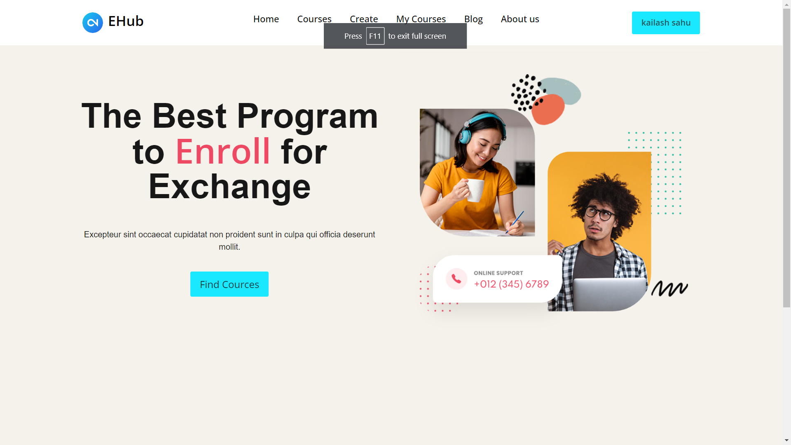
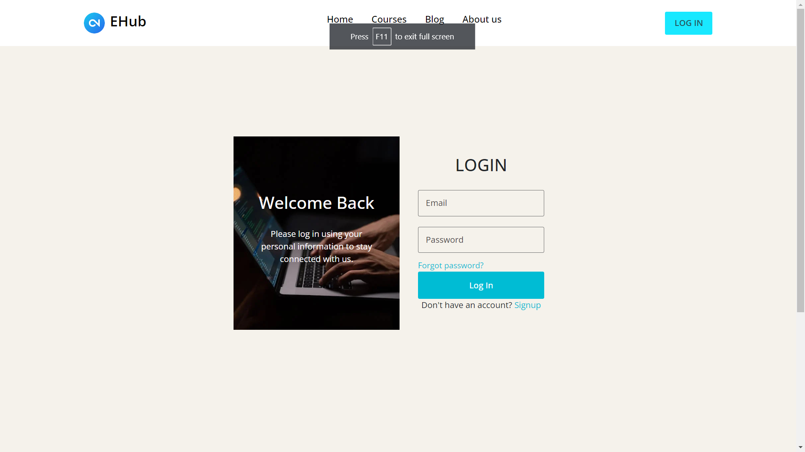
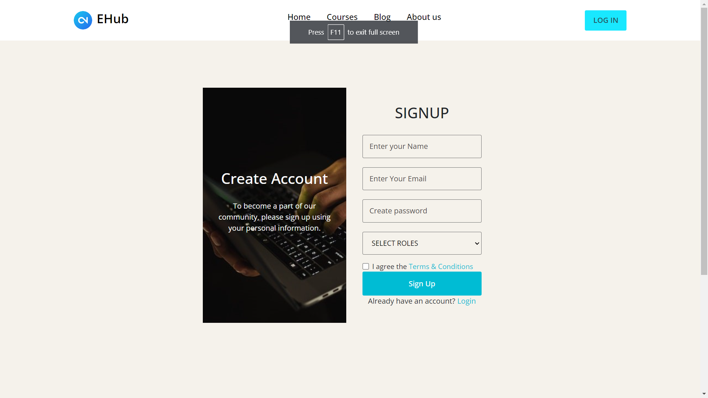
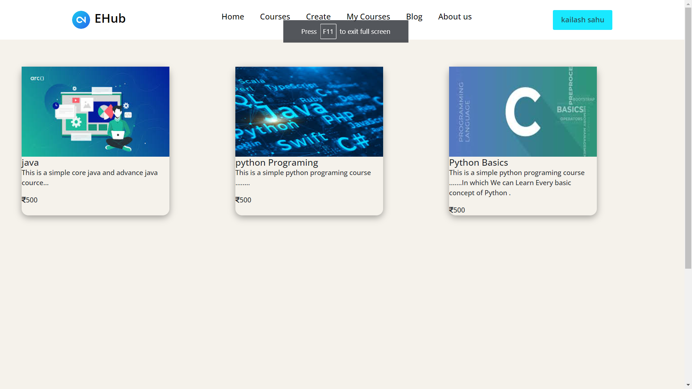
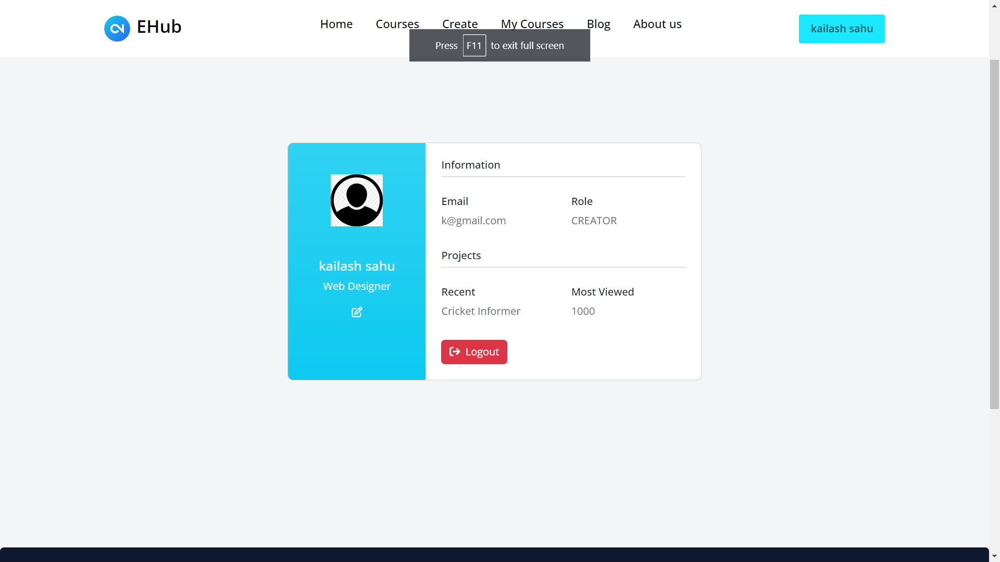

# EHub - Online Learning Platform

## Description
EHub is an e-learning platform built using **Spring Boot, Thymeleaf, Postgres, and Spring Security**.  
It helps users learn new technologies effectively.

## Features
- User Authentication (Spring Security)
- Course Management
- Interactive Learning

## Tech Stack
- **Backend:** Spring Boot (MVC)
- **Frontend:** Thymeleaf
- **Database:** PostgreSQL

## Screenshots
### Homepage

### Login Page

## Setup Guide
For detailed setup instructions, check out the [Setup Guide](setup_guide.md).
